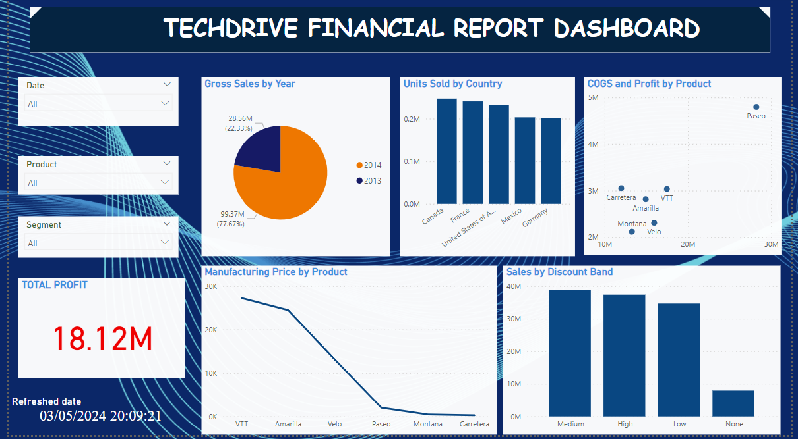
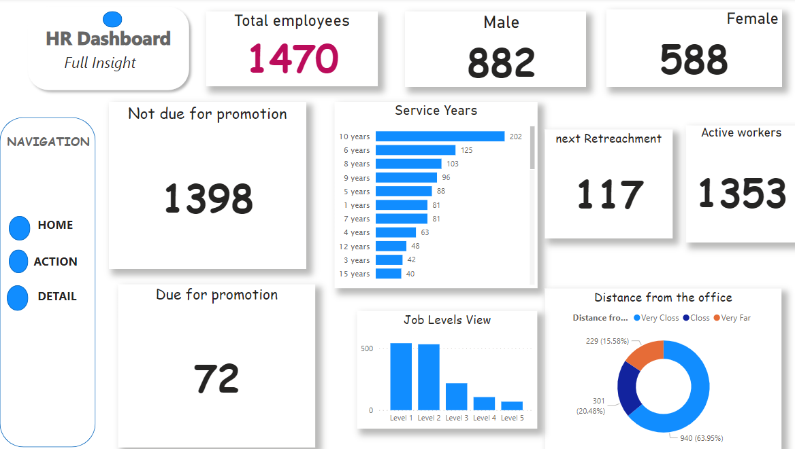
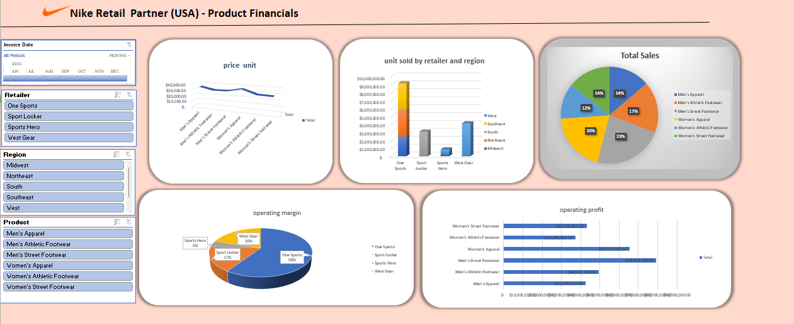

# Sharon Iyhoghama Data Analytics portfolio
 
# Project 1
 
**Title:** [Techdrive Financial Report Dashbroad](https://github.com/Iyhoghamash/Iyhoghamash.github.io)
 
**Project Summary:** This project was carried out to provide an insight on the financial position of techdrive for 2024.
 
**Dashboard Overview:** 

# Project 2
 
**Title:** [HR Analytics Dashboard](https://github.com/Iyhoghamash/Iyhoghamash.github.io)
 
**Project Summary:** This project was carried out to provide an insight on the employee details to measure their status and demographics within the organization .
 
**Dashboard Overview:** 

# Project 3
 
**Title:** [Nike Retail Partner Financials](https://github.com/Iyhoghamash/Iyhoghamash.github.io)
 
**Project Summary:** This project was carried out to provide the financial insight on Nike retail partnerships in the USA. this data was analyzed with the use of excel, the major focus was the unit sold, price per product, total sales, operating profit and operating margin of retailers from different region. we could connote from the data that "Onesport" has the highest profit margin but it is advised for them to put in more advert for female atheletic footwear because it is the lowest most profitable. it is also advised that other retailers like "sport locker, sports hero and west gears" should extend ttheir publicity into different regions to make more sales and operating profit.

**Dashboard Overview:** 

